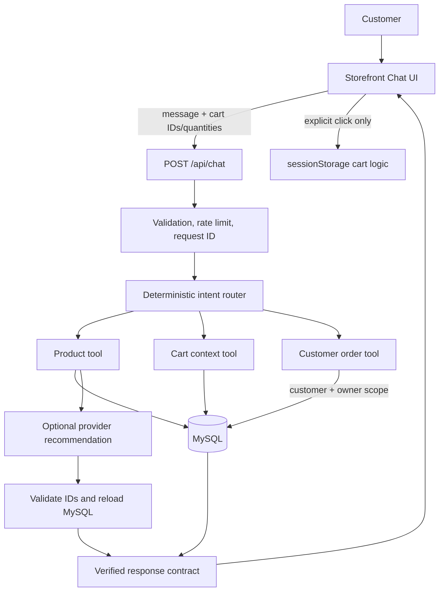

# Grounded Conversational AI Assistant

## Purpose and scope

The customer chat endpoint is a bounded commerce assistant. It interprets a
message, routes it to a small read-only capability, reloads commerce facts from
MySQL, and returns a structured response. It does not have generic SQL, HTTP,
payment, order-update, or admin capabilities.



The implementation follows one invariant:

> The model interprets; Laravel retrieves; MySQL verifies; tools stay within
> permissions; the customer confirms cart writes.

## Request flow

`POST /api/chat` accepts a message of at most 500 characters, bounded display
history, and at most 20 cart references. Each cart reference has exactly
`product_id` and `quantity`; extra names, prices, stock, or totals are rejected.
History remains a browser display concern and is not forwarded to a provider.

The router returns one enum value:

- `product_search`
- `product_detail`
- `cart_query`
- `cart_action_request`
- `order_query`
- `general_chat`
- `unsupported`

Deterministic product filters, cart queries, greetings, and order lookups do not
need a provider request. A semantic recommendation first retrieves a bounded
set of active product records and gives the provider at most five evidence
records. This keeps the normal path to router → retrieval → at most one model
call.

## Read-only tools

### Product tool

`ChatProductTool` supports bounded database filters for active status, category,
price, stock, query text, and result limit. The existing lexical scorer ranks
name, category, and short-description tokens. Every chosen provider ID is then
reloaded from MySQL and serialized into a product card containing only approved
fields.

### Cart context tool

`ChatCartTool` reloads every submitted ID, checks active state and current
inventory, and compares the current quantity. It never trusts browser product
objects. Cart queries are read-only. An add request becomes a
`suggested_actions` item; the Storefront must render and receive a separate
customer click before using its existing cart hook.

### Customer order tool

`ChatOrderTool` accepts only an authenticated user whose role is `customer`.
Both exact and recent-order queries include `where user_id = current_user_id`.
The output contains only order ID, order status, payment status/method, total,
and creation time. It excludes contact details, notes, payment references,
transaction IDs, and admin history. No chat tool can modify an order or payment.

## Response contract

The endpoint keeps `reply` for older consumers and also returns `message`:

```json
{
  "message": "Tôi đã tìm thấy Cam Tươi.",
  "reply": "Tôi đã tìm thấy Cam Tươi.",
  "intent": "cart_action_request",
  "products": [
    {
      "id": 123,
      "slug": "cam-tuoi",
      "name": "Cam Tươi",
      "price": 45000,
      "inventory": 30,
      "inventory_status": "in_stock",
      "image_url": "https://...",
      "category": { "id": 1, "name": "Trái Cây" }
    }
  ],
  "suggested_actions": [
    { "type": "ADD_TO_CART", "product_id": 123, "quantity": 2 }
  ],
  "conversation": { "id": "session-scoped opaque ID" },
  "action": { "type": "none" },
  "source": "catalog"
}
```

The legacy `action` field is deliberately inert. Suggested actions are kept
only when their product ID exists in the verified `products` list and quantity
is an integer from 1 to 100.

## Provider capabilities and fallback

The provider service supports Groq, Ollama, and Anthropic transports. Its
capability report describes only behaviors enabled by this implementation:
strict/structured output for the configured Groq and Ollama paths, no streaming,
and no provider-controlled tool loop. Anthropic uses the same server-side JSON
validation boundary but is not advertised as strict structured output.

Groq Structured Outputs are used in a separate product-ID selection call. The
implementation does not combine Structured Outputs with tool use because the
current Groq documentation says that combination is unavailable. Ollama uses a
JSON schema through its structured-output interface. Provider errors from all
drivers return a deterministic catalog fallback; authorization and validation
errors are not retried.

References:

- [Groq Structured Outputs](https://console.groq.com/docs/structured-outputs)
- [Groq Tool Use](https://console.groq.com/docs/tool-use/overview)
- [Ollama Structured Outputs](https://docs.ollama.com/capabilities/structured-outputs)
- [Ollama Tool Calling](https://docs.ollama.com/capabilities/tool-calling)
- [Anthropic Tool Use](https://platform.claude.com/docs/en/agents-and-tools/tool-use/overview)

## Trust boundaries and security

- Browser messages, history, cart references, and provider output are untrusted.
- Product price, inventory, active state, and category come from a fresh MySQL
  read before serialization.
- Order reads require authentication, the customer role, and owner scoping.
- Chat has no payment mutation, SePay confirmation, arbitrary SQL, arbitrary
  URL, admin, or generic execution tool.
- The endpoint keeps its existing IP/global rate limits and request IDs.
- Structured logs contain intent, source, provider, counts, timing, status, and
  an HMAC user identifier. Raw prompts, cart contents, cookies, credentials,
  and payment data are not logged.
- Assistant content is rendered as React text. It is not inserted as HTML.

These boundaries follow the practical guidance in the
[OWASP LLM Prompt Injection Prevention Cheat Sheet](https://cheatsheetseries.owasp.org/cheatsheets/LLM_Prompt_Injection_Prevention_Cheat_Sheet.html)
and [OWASP Excessive Agency guidance](https://genai.owasp.org/llmrisk/llm062025-excessive-agency/).

## Conversation memory

There is no long-term AI memory. The browser retains a bounded visible history,
while the backend stores only a five-minute, session-and-owner-scoped purchase
clarification context. It cannot be authorized from browser-supplied assistant
messages and is cleared on expiry, owner change, negation, or topic change.

## Evaluation and future search path

`tests/Fixtures/chat_evaluation.php` is a versioned local fixture for intent and
retrieval behavior. `ChatEvaluationTest` reports intent accuracy, HitRate@5,
MRR@5, nDCG@5, and local router/retrieval duration. It is intentionally small;
the numbers are regression evidence, not production traffic quality claims.

Database-only retrieval remains the configured mode. Qdrant and hybrid fusion
are deferred until a larger labeled VI/EN query set proves a material lexical
recall gap. If that happens, the next step is a feature-flagged, idempotent index
sync with MySQL reload as the final authority and database fallback whenever the
vector service is unavailable. Qdrant's Query API and RRF are candidates, not
current implementation: [Qdrant hybrid queries](https://qdrant.tech/documentation/search/hybrid-queries/).
