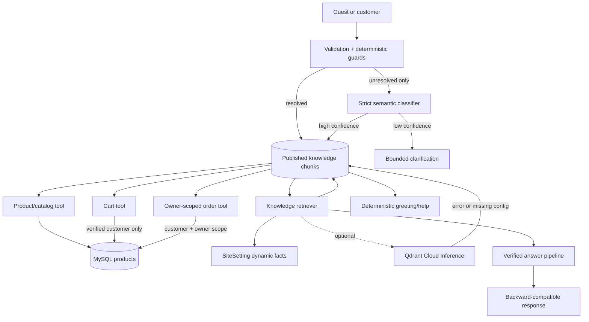

# Grounded Commerce Assistant

## Trust model and request flow

`POST /api/chat` is public so guests can discover products and ask store FAQs.
The endpoint accepts a 500-character message, bounded display history, and at
most 20 cart references shaped only as `{product_id, quantity}`. Browser history
is never treated as evidence or forwarded to a provider.



The router returns `product_search`, `product_detail`, `cart_query`,
`cart_action_request`, `order_query`, `knowledge_query`, `general_chat`, or
`unsupported`; unresolved messages become `clarification`. Deterministic guards
always handle forbidden actions first. The optional semantic classifier sees
only the current message, selects from a closed intent/entity schema and cannot
call tools. Its result never bypasses authentication, role or ownership checks.

## Authority boundaries

- Product name, price, inventory, active state and image come from fresh MySQL
  reads. Provider output can select only IDs already present in evidence.
- Shipping fee, free-shipping threshold, contact and address come directly from
  `SiteSetting`.
- Policy answers use only indexed `published` documents. Drafts, samples,
  placeholders and instruction-like content are not indexed.
- Order queries require a customer account and always include owner scoping.
- Chat has no order/payment mutation, admin, arbitrary SQL/URL, or generic
  execution capability. The legacy `action` field is always `{ "type": "none" }`.

## Cart authorization

Only a user with role `customer` and verified email may receive
`ADD_TO_CART`. A guest cart query or mutation returns HTTP 200 with
`code=AUTH_REQUIRED_FOR_CART`, `auth.required=true`, no suggested action, and an
optional verified product card. `respond()` rechecks authorization while
filtering actions, so a malformed/internal payload cannot bypass the boundary.

The Storefront independently enforces the same rule in `useShoppingCart`. It
waits for auth bootstrap, binds session cart storage to the customer ID, clears
stale storage after logout/session loss/owner change, sends no guest cart
context, and requires a new explicit click after login.

## Knowledge retrieval and answer verification

Query normalization uses ASCII matching and whitespace normalization while the
original question remains unchanged for display/generation. Deterministic
synonym expansion produces at most three variants. Optional model expansion
uses strict JSON only when sparse confidence is low and the feature flag is on.

Sparse ranking weights title, heading, topic and retrieval text. Retrieval text
contains the approved title/topic plus optional aliases/sample questions and the
section heading/content. It is discarded before answer generation; only section
`content` is evidence and may be cited. Optional dense ranks
come directly from Qdrant Cloud Inference using
`intfloat/multilingual-e5-small`. The dedicated collection accepts only Farta
chat knowledge names; point IDs and payload `chunk_id` values match MySQL chunk
IDs. Reciprocal Rank Fusion uses `k=60`; failures fall back to sparse and never
fail the chat request. At most five chunks become evidence.

With generated knowledge answers enabled, the provider must return strict JSON
containing claims, source indices and exact evidence quotes. Laravel validates
indices and substring-exact quotes, then a second strict verifier checks
entailment. One repair is allowed. Failure returns
`answer_status=refused_unverified`. When generation is disabled, the answer is a
direct extract from the highest-ranked approved chunk and remains traceable.

```json
{
  "message": "Phí giao hàng tiêu chuẩn là 20.000đ.",
  "reply": "Phí giao hàng tiêu chuẩn là 20.000đ.",
  "intent": "knowledge_query",
  "source": "knowledge",
  "answer_status": "verified",
  "citations": [
    {
      "source_id": "site-settings",
      "title": "Thông tin giao hàng",
      "section": "Phí giao hàng"
    }
  ],
  "products": [],
  "suggested_actions": [],
  "action": { "type": "none" }
}
```

## Context and observability

There is no long-term memory. A five-minute server context stores only product
ID, quantity, clarification stage, owner ID and expiry. It is cleared on expiry,
owner/topic change or negation. No raw cart, payment reference or sensitive
profile data is stored.

Logs contain request ID, HMAC user identifier, intent, routing mode, router
confidence, source IDs, counts,
retrieval mode, vector fallback, answer status, provider/model and timing. They
do not contain raw prompts/history/cart contents, cookies, API keys, addresses
or payment details.

See [chat-rag.md](chat-rag.md) for retrieval/evaluation and
[chat-knowledge-authoring.md](chat-knowledge-authoring.md) for publishing.
