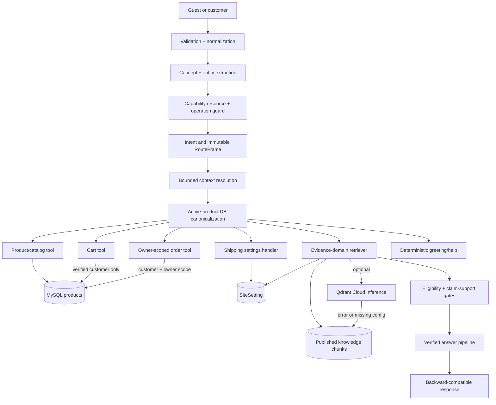

# Grounded Commerce Assistant

## Trust model and request flow

`POST /api/chat` is public so guests can discover products and ask store FAQs.
The endpoint accepts a 500-character message, bounded display history, and at
most 20 cart references shaped only as `{product_id, quantity}`. Browser history
is never treated as evidence or forwarded to a provider.


```mermaid
flowchart TD
    U[Guest or customer] --> API[Validation + normalization]
    API --> X[Concept + entity extraction]
    X --> CG[Capability resource + operation guard]
    CG --> D[Intent and immutable RouteFrame]
    D --> CTX[Bounded context resolution]
    CTX --> CAN[Active-product DB canonicalization]
    CAN --> P[Product/catalog tool]
    CAN --> C[Cart tool]
    CAN --> O[Owner-scoped order tool]
    CAN --> S[Shipping settings handler]
    CAN --> K[Evidence-domain retriever]
    CAN --> G[Deterministic greeting/help]
    P --> DB[(MySQL products)]
    C -->|verified customer only| DB
    O -->|customer + owner scope| DB
    S --> SS[(SiteSetting)]
    K --> SS
    K --> KD[(Published knowledge chunks)]
    K -. optional .-> V[Qdrant Cloud Inference]
    V -->|error or missing config| KD
    K --> E[Eligibility + claim-support gates]
    E --> A[Verified answer pipeline]
    A --> OUT[Backward-compatible response]
```

The router keeps the public enum compatible while attaching a more precise
`semantic_intent`, `resource`, and `operation` to one immutable
`ChatRouteFrame`. Semantic intents distinguish price, stock, search, catalog,
cart guidance/action/read, order/payment reads, current shipping values,
shipping calculations, supported knowledge, missing evidence, OOD, denied
mutations, and clarification. Deterministic guards always handle forbidden
actions first.
The response `decision_state` distinguishes `supported`, `clarification`,
`unsupported`, and `denied_action` without granting any new capability.
Messages with multiple independently actionable domains become explicit child
route frames. Each child owns its intent, entities, terminal, handler, and
required evidence domain; a denied, no-evidence, or clarification branch does
not erase safe siblings. There is no agent loop.
Cart intent classification and cart entity extraction are separate. The shared
`ChatEntityExtractor` recognizes bounded Vietnamese/English whole-number
quantities and candidate product spans. `ChatEntityCanonicalizer` then resolves
the ordered candidates and context IDs against active MySQL products, including
each composite branch. Extraction and canonicalization never grant authority to
write the cart.
The optional semantic classifier sees only the current message, selects from a
closed intent/entity schema and cannot call tools. Its result never bypasses
capability, authentication, ownership, evidence, or business guards. It was not
used by the Phase 14 candidate: the environment had no versioned comparable
classifier, and the deterministic concept router remained stronger evidence.

## Authority boundaries

- Product name, price, inventory, active state and image come from fresh MySQL
  reads. Provider output can select only IDs already present in evidence.
- `shipping_info` reads the current shipping fee and free-shipping threshold
  directly from `SiteSetting`; these values never depend on vector ranking.
- Contact and address facts are sourced from `SiteSetting` when the knowledge
  retriever answers those topics.
- Policy answers use only an immutable routed evidence domain and its
  application-owned source allow-list. Indexed documents must be published,
  owned by Farta Market, topic-matching, evidence-eligible, and claim-supporting.
  Drafts, samples, placeholders and instruction-like content are not indexed.
- Authority order is database/business services, then approved knowledge, then
  optional LLM synthesis. A generated answer cannot override fresher structured
  values.
- Order queries require a customer account and always include owner scoping.
- Chat has no order/payment mutation, admin, arbitrary SQL/URL, or generic
  execution capability. The legacy `action` field is always `{ "type": "none" }`.

## Cart authorization

Only a user with role `customer` and verified email may receive
`ADD_TO_CART`. A guest cart query or mutation returns HTTP 200 with
`code=AUTH_REQUIRED_FOR_CART`, `auth.required=true`, no suggested action, and an
optional verified product card. `respond()` rechecks authorization while
filtering actions, so a malformed/internal payload cannot bypass the boundary.

The Storefront independently enforces the same rule in `useShoppingCart`. It
waits for auth bootstrap, binds session cart storage to the customer ID, clears
stale storage after logout/session loss/owner change, sends no guest cart
context, and requires a new explicit click after login.

## Knowledge retrieval and answer verification

Query normalization uses ASCII matching and whitespace normalization while the
original question remains unchanged for display/generation. Deterministic
synonym expansion produces at most three variants. Optional model expansion
uses strict JSON only when sparse confidence is low and the feature flag is on.

Sparse ranking weights title, heading, topic and retrieval text. Retrieval text
contains the approved title/topic plus optional aliases/sample questions and the
section heading/content. It is discarded before answer generation; only section
`content` is evidence and may be cited. Optional dense ranks
come directly from Qdrant Cloud Inference using
`intfloat/multilingual-e5-small`. The dedicated collection accepts only Farta
chat knowledge names; point IDs and payload `chunk_id` values match MySQL chunk
IDs. The immutable router domain first constrains MySQL candidates by topic,
published status, owner, and allowed `source_id`. Dense queries also send
Qdrant `topic` and `source_id` filters; dense IDs outside the locally eligible
candidate set are discarded before Reciprocal Rank Fusion (`k=60`). A final
deterministic eligibility and claim-to-section check runs after ranking. Vector
failures fall back to domain-scoped sparse retrieval and never widen authority.
At most five chunks become evidence.

With generated knowledge answers enabled, the provider must return strict JSON
containing claims, source indices and exact evidence quotes. Laravel validates
indices and substring-exact quotes, then a second strict verifier checks
entailment. One repair is allowed. Failure returns
`answer_status=refused_unverified`. When generation is disabled, the answer is a
direct extract from the highest-ranked approved chunk and remains traceable.

```json
{
  "message": "Phí giao hàng tiêu chuẩn là 20.000đ.",
  "reply": "Phí giao hàng tiêu chuẩn là 20.000đ.",
  "intent": "shipping_info",
  "source": "site-settings",
  "answer_status": "verified",
  "citations": [
    {
      "source_id": "site-settings",
      "title": "Thông tin giao hàng",
      "section": "Phí giao hàng"
    }
  ],
  "products": [],
  "suggested_actions": [],
  "action": { "type": "none" }
}
```

## Context and observability

There is no long-term memory. A five-minute server context stores at most five
ordered canonical product IDs, one optional category ID, quantity, result type,
clarification stage, owner ID, and expiry. It resolves bounded singular,
plural-read, ordinal, category, possessive/deictic, cart-continuation, and
elliptical follow-ups against freshly loaded active products. A singular or
action reference over multiple candidates clarifies instead of selecting
silently.
It is cleared on expiry, owner/topic change or negation. An auth-required guest
cart response may retain only the product reference for later informational
questions; it never resumes the proposed cart action after login. No price,
stock, raw cart, order/payment reference, or sensitive profile data is stored.

Logs contain request ID, HMAC user identifier, intent, routing mode, router
confidence, semantic resource/operation, required evidence topic, retrieved and
accepted source IDs, counts, retrieval mode, vector fallback, answer status,
provider/model and separate router, database, sparse, dense, fusion, generation,
verification and total timings. They
do not contain raw prompts/history/cart contents, cookies, API keys, addresses
or payment details.

See [chat-rag.md](chat-rag.md) for retrieval/evaluation and
[chat-knowledge-authoring.md](chat-knowledge-authoring.md) for publishing.
